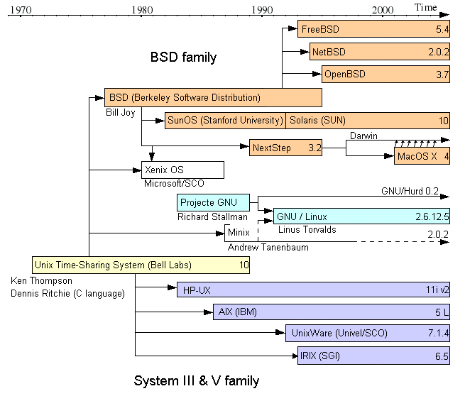
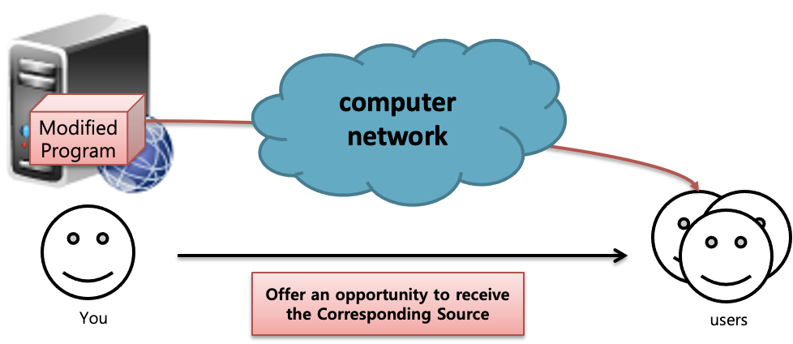
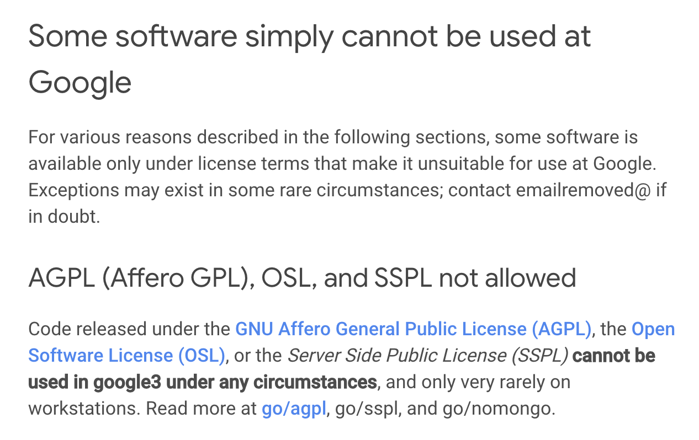
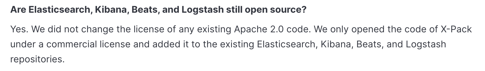
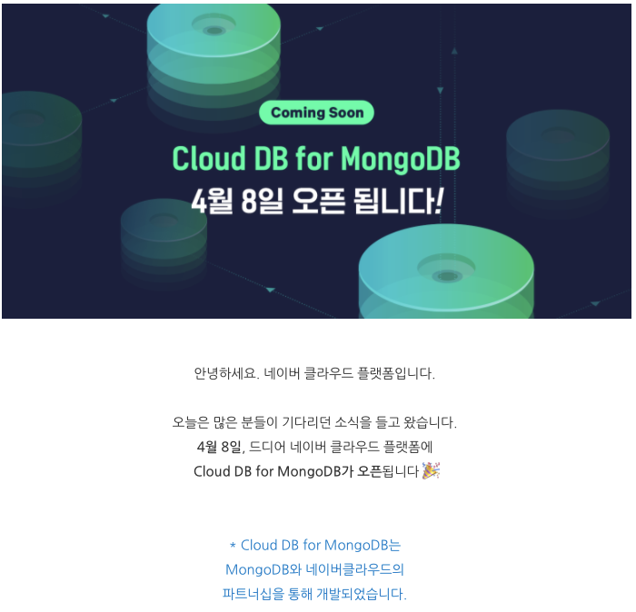

# 진화하는 오픈소스 라이선스 (Elastic License 2.0)

연구자 : 장학성

## 1. 요약

1990년대 만들어진 GPL-2.0에 이어 2007년 AGPL-3.0이 나오고, 클라우드 서비스의 확산과 함께 SSPL까지 만들어진 배경에 대해 살펴본다. 이에 그치지 않고, Elastic이 대표적인 클라우드 서비스 프로바이더인 AWS와 대립하며 Elastic License 2.0이라는 새로운 라이선스를 만든 과정을 조사하고, 나아가서 새로운 트렌드가 되고 있는 소스 공유 라이선스에 대해 알아본다. 

(참고) *"[Elastic License 2.0 and the Evolution of Open Source Licensing](https://www.coss.community/cossc/elastic-license-2-0-and-the-evolution-of-open-source-licensing-3jb3)"*


## 2. 오픈소스 라이선스 역사

### 가. 유닉스

UNIX는 1973년 AT&T 벨연구소에서 발표하였다. 1950년대 AT&T가 IBM과 맺은 협약(컴퓨터 사업 진출 불가)때문에 저렴한 가격($99)으로 소스코드와 함께 제공하였다. 또한 버클리대학에 연구목적으로 무료로 제공하였다. 

1977년, 버클리 대학에서는 일종의 UNIX 확장판인 BSD (Berkeley Software Distribution) 개발하여 이미 UNIX를 구매한 기관/개인에게 저장매체 (30개의 테이프) 비용과 배송비만 받고 무료로 제공하였다. 1983년, AT&T가 쪼개지면서 UNIX를 상업적으로 판매가 가능해졌고, $99인 가격이 $250,000로 인상되었다. BSD를 사용하려는 회사 입장에서 UNIX 라이선스를 구매하기는 부담이 됐다. 1986년, CSRG(Computer Systems Research Group)는 BSD 네트워킹 코드만 따로 분리해서 UNIX 라이선스 없이 사용할 수 있는 BSD Networking Release를 공개하였고, BSD 라이선스를 적용하였다. 그리고, 1991년, CSRG는 UNIX 코드를 제거한 BSD UNIX를 출시하여 무료로 제공하였다. 이에 심기가 불편해진 AT&T가 저작권 침해로 고소하였고, BSD측도 AT&T UNIX에 포함된 BSD 코드에 대하여 맞고소하였다. 결국, 1994년, 각자 UNIX를 판매할 수 있도록 합의하였으나, 소송 기간 동안 BSD UNIX가 배포되지 못하면서, 완전한 BSD UNIX가 나오기까지 2년여의 시간이 낭비되었다. 각 업체별로 각자 수정한 운영체제를 사용하며 많은 종류로 쪼개지고, 그 사이 리눅스가 탄생한다. 



[https://upload.wikimedia.org/wikipedia/commons/c/c5/Unix_timeline.en.png](https://upload.wikimedia.org/wikipedia/commons/c/c5/Unix_timeline.en.png)


### 나. 자유소프트웨어 운동과 GPL

1984년, 리차드 스톨만은 이맥스 편집기 GNU 버전을 개발하였다. 그리고, 1985년 Free Software Foundation을 설립하여 사유화되는 유닉스를 대체하고자 하였다. 그는 소스 코드에 대한 접근, 개선 및 변경 사항을 만들고 공유할 수 있는 권리 주장하였고, GPL (GNU General Public) License를 만들어서 바이너리 배포자는 해당 소스 코드를 공유해야 한다고 주장하였다. 당시 대부분의 소프트웨어는 직접 설치(on-premise) 방식이기 때문에 GPL 효과적은 효과적인 라이선스였다. 

### 다. 네트워크 서비스 출현과 AGPL

2000년대 이후 네트워크 서비스가 보편화되면서 더 이상 소프트웨어를 배포하지 않고도 고객에게 서비스를 제공할 수 있게 되었다. 이에 대응하기 위해 Free Software Foundation은 GPL을 부분 변경한 AGPL-3.0을 만들었다

##### 1) AGPL-3.0

AGPL-3.0은 GPL-3.0에 13조, Remote Network Interaction 조항을 추가한 라이선스이다. 

```
💡 13. Remote Network Interaction; Use with the GNU General Public License.

Notwithstanding any other provision of this License, if you modify the 
Program, your modified version must prominently offer all users interacting 
with it remotely through a computer network (if your version supports 
such interaction) an opportunity to receive the Corresponding Source of 
your version by providing access to the Corresponding Source from a 
network server at no charge, through some standard or customary means 
of facilitating copying of software. This Corresponding Source shall 
include the Corresponding Source for any work covered by version 3 of 
the GNU General Public License that is incorporated pursuant to the 
following paragraph.
```

- Computer network을 통해 remote로 interacting하는 모든 user에게 source code 제공 요구
- 오픈소스를 이용하여 Network으로 서비스할 때, 개선한 소스 코드의 공유를 강제하기 위함



참고로 Google에서는 AGPL하 오픈소스의 사용을 금지한다. (AGPL 뿐만 아니라, SSPL도 불허)



[https://opensource.google/docs/thirdparty/licenses/#agpl-affero-gpl-osl-and-sspl-not-allowed](https://opensource.google/docs/thirdparty/licenses/#agpl-affero-gpl-osl-and-sspl-not-allowed)

Google은 회사의 핵심 제품이 원격 네트워크 인터페이스 (검색, Gmail, 지도, YouTube)를 통해 사용자와 상호작용하는 제품으로 구성되고, 이로 인해 AGPL이 예기치 않은 위험을 유발할 수 있기 때문에 AGPL-3.0 소프트웨어의 사용을 불허한다고 밝히고 있다. 

](2021-img/2021-elastic3.png)

[https://opensource.google/docs/using/agpl-policy/](https://opensource.google/docs/using/agpl-policy/)

#### 2) mongoDB의 AGPL 채택

](2021-img/2021-elastic4.png)

[https://www.mongodb.com/community/licensing](https://www.mongodb.com/community/licensing)

2009년, mongoDB도 네트워크 서비스라는 loophole을 메우기 위해 APGL-3.0 라이선스를 적용하였다(Dual License 모델 : AGPL or 상용 ). 

당시 AGPL을 활용한 Dual License 비즈니스 모델은 상당히 유용하였다. 

### 라. Strip-Mining

2010년대 Cloud 서비스가 발전하면서 AGPL 듀얼 라이선스 모델도 압박을 받기 시작하였다. AWS등의 대형 Cloud Service Provider가 오픈소스를 무료로 가져다가 Plug and Play 형태로 제공하며 수익 창출하였던 것이다. 

- 예: Amazon DocumentDB(MongoDB 호환)
    
    ](2021-img/2021-elastic5.png)
    
    [https://aws.amazon.com/documentdb/](https://aws.amazon.com/ko/documentdb/)
    

mongoDB도 Cloud Service를 제공하지만, Cloud Service Provider의 고객은 기존 계약 방식으로 손쉽게 사용할 수 있는 Cloud Service Provicer의 서비스를 선택하였다. 

](2021-img/2021-elastic6.png)

[https://www.mongodb.com/cloud](https://www.mongodb.com/cloud)

Modified Program에 한하여 소스 공개를 요구하는 AGPL로는 mongoDB의 수익 악화를 막을 수가 없었다. 이와 같이 오픈소스 상용 기업의 오픈소스 제품은 대형 Cloud Service Provider가 무료로 갖다 쓰기 좋은 먹잇감이 되버렸다("Strip-Mining"). 

](2021-img/2021-elastic7.png)

[https://steemkr.com/kr/@syjk96/3r449k](https://steemkr.com/kr/@syjk96/3r449k)

### 마. Strip-mining을 막기 위한 라이선스 물결

#### 1) 소스 가용 라이선스 (Source Available License)

AWS 등 Cloud Service Provider가 오픈소스로 서비스를 하면서 계속 인기를 얻자, 2018년 오픈소스 업계는 새로운 돌파구를 찾는다. 바로, 라이선스 변경의 물결이 시작된다. 2018년 이후 발생한 라이선스 변경의 물결 속에 출시된 거의 모든 라이선스는 비슷한 제한을 갖고 있다. 2018년부터 Redis Labs, Cockroach Labs, Confluent 및 MongoDB 등 최소 4개 이상의 수십억 달러 규모의 회사가 소프트웨어 라이선스를 변경하였고, 이는 AWS의 대규모 고객 기반 소프트웨어 재판매 차단하기 위해서이다. 

- [SSPL](https://www.mongodb.com/licensing/server-side-public-license)
- [Commons Clause](https://commonsclause.com/)
- [Redis](https://redislabs.com/legal/licenses/)
- [Confluent](https://www.confluent.io/confluent-community-license)
- [CockroachDB](https://www.cockroachlabs.com/cockroachdb-community-license/)
- [Elastic License](https://www.elastic.co/kr/licensing/elastic-license/)

각각 고유한 조건이 있지만, 이들은 모두 사용자가 소프트웨어를 무료로 사용할 수 있도록 허용하는 동시에 경쟁 호스팅 서비스 제공 업체들의 소프트웨어 사용을 금지하는 데 초점을 맞추고 있다. 이 중 몇가지 라이선스를 보다 자세히 다뤄본다. 

#### 2) SSPL

SSPL은 MongoDB가 만든 소스 공유 라이선스 (Source Available License)이다. : [https://www.mongodb.com/licensing/server-side-public-license](https://www.mongodb.com/licensing/server-side-public-license)

mongoDB는 Dual License 모델을 (AGPL or 상용)에서 (SSPL or 상용) 으로 변경하였다. SSPL은 AGPL-3.0과 13조만 다르다. 

```
📖 13. Offering the Program as a Service.

If you make the functionality of the Program or a modified version 
available to third parties as a service, you must make the Service
Source Code available via network download to everyone at no charge, 
under the terms of this License. Making the functionality of the 
Program or modified version available to third parties as a service 
includes, without limitation, enabling third parties to interact with 
the functionality of the Program or modified version remotely 
through a computer network, offering a service the value of which 
entirely or primarily derives from the value of the Program or modified 
version, or offering a service that accomplishes for users the primary 
purpose of the Program or modified version.

“Service Source Code” means the Corresponding Source for the Program 
or the modified version, and the Corresponding Source for all programs 
that you use to make the Program or modified version available as a 
service, including, without limitation, management software, user 
interfaces, application program interfaces, automation software, 
monitoring software, backup software, storage software and hosting 
software, all such that a user could run an instance of the service 
using the Service Source Code you make available.

```

SSPL의 13조는 다른 사람에게 제품을 서비스로 제공(SaaS : Software-as-a-Service)하는 경우, Service Source Code도 공개할 것을 요구한다. 여기서 Service Source Code란 서비스를 위한 관리 계층의 모든 소스 코드와 수정 사항을 의미하며, 이는 AGPL보다 소스 코드 공개 조건 훨씬 광범위하다. SSPL은 OSI (Open Source Initiative : [https://opensource.org/](https://opensource.org/))의 승인을 받지 못하였다. 

여기까지 발전하는 기술과 이익 충돌에 인한 오픈소스 라이선스의 변경 역사에 대해 간단히 알아보았다. 

이후에는 Elastic이 ElasticSearch 등의 제품을 Elastic License 2.0으로 라이선스를 변경한 배경과 AWS와의 대립하는 상황과 시사점에 대해 설명한다.

---

## 3. Elastic과 AWS의 충돌

### 가. Elastic 살펴 보기

#### 1) 역사

Shay Banon은 2009년 개인 프로젝트로 ElasticSearch를 개발하기 시작하였고, 2010년 ElasticSearch를 Apache-2.0 라이선스를 적용하여 오픈소스로 공개하였다. ([https://www.elastic.co/kr/blog/you-know-for-search](https://www.elastic.co/kr/blog/you-know-for-search)), 그리고, 2012년 Elastic사를 설립하였다.

Elastic의 주요 제품은 Elastic Stack (Elasticsearch, Kibana, Beats, Logstash)이며 전부 Apache-2.0하의 오픈소스였다. 

](2021-img/2021-elastic8.png)

[http://kimjmin.net/2020/06/2020-06-elastic-devrel/](http://kimjmin.net/2020/06/2020-06-elastic-devrel/)

#### 2) ElasticSearch

이중 대표적인 제품인 Elasticsearch의 주요 특징은 다음과 같다. 

- Apache Lucene (루씬) 기반 분산형 검색 엔진
- 비관계형 데이터베이스와 유사
- 매우 빠른 검색 속도 → 각종 분석에서 기본이 되는 엔진
- RESTful API 제공 - 데이터를 넣으면 API로 바로 Json 형태로 데이터 사용

](2021-img/2021-elastic9.png)

[https://engineering.linecorp.com/ko/blog/excel-to-elastic/](https://engineering.linecorp.com/ko/blog/excel-to-elastic/)

ElasticSearch는 오픈소스이므로 다양한 기능의 플러그인이 많이 나와 있다. 

Elastic은 Cloud Service 형태로도 ElasticSearch를 제공한다. 

### 나. 초창기 Elastic 수익 구조

Elastic의 주요 수익 구조는 다음 세가지 형태로 구분된다. 

1. 유료 솔루션 제공 
    
    먼저, 오픈소스 외에 유료 솔루션을 제공하였다. 
    
    - Elastic Enterprise Search (App Search, Workspace Search)
    - Elastic Observability
    - Elastic Security
2. Cloud 서비스 제공
    
    위에서도 잠깐 언급했지만, Elasticsearch등 주요 제품을 Cloud 서비스로 제공한다. 
    
3. 기술지원
그리고 유상 기술 지원을 제공한다. 

### 다. Elastic과 AWS와의 대립

#### 1) AWS (2015-10-01)

AWS는 2015년 10월, Amazon Elasticsearch Service를 발표하였다. : [https://aws.amazon.com/ko/blogs/aws/new-amazon-elasticsearch-service/](https://aws.amazon.com/ko/blogs/aws/new-amazon-elasticsearch-service/)

Apache-2.0인 Elasticsearch로 유료 service 제공한 것인데 이는 저작권 측면의 법적 문제는 없다고 볼 수 있다. 여기서는 일단 상표권은 논외로 한다. 

2021-img/2021-elastic10.png)

그런데, 이때 Amazon의 CTO가 이는 Elastic과 AWS의 훌륭한 파트너십에 의한 결과물이었다고 자평하였으나, 정작 Elastic은 AWS와 협업한 바가 없다고 부인하는 일이 발생한다. 

](2021-img/2021-elastic11.png)

[https://www.elastic.co/kr/blog/why-license-change-AWS](https://www.elastic.co/kr/blog/why-license-change-AWS)

#### 2) Elastic (2018-04-20)

위의 Strip mining을 막기위한 라이선스 물결에서 말했듯이, Elastic은 Elastic License 1.0 ([https://github.com/elastic/beats/blob/master/licenses/ELASTIC-LICENSE.txt](https://github.com/elastic/beats/blob/master/licenses/ELASTIC-LICENSE.txt))을 발표하며 라이선스 정책을 변경한다. 이는 Elastic 코드를 AWS Elasticsearch Service와 같은 Service 형태로 재판매하는 것을 금지하기 위해서였다. Elastic은 Elasticsearch 6.3 버전부터 확장 기능에 대해 Elastic License 적용하였고, 기본 기능은 여전히 기본 기능은 여전히 Apache-2.0 유지하였다. 

](2021-img/2021-elastic12.png)

[http://kimjmin.net/2018/08/2018-08-install-security-over-es63/](http://kimjmin.net/2018/08/2018-08-install-security-over-es63/)

](2021-img/2021-elastic13.png)

[http://kimjmin.net/2020/06/2020-06-elastic-devrel/](http://kimjmin.net/2020/06/2020-06-elastic-devrel/)

- Free / Open (오픈소스) : Apache-2.0
- Free / Basic (기본) : Elastic License 1.0

#### 3) Elastic 상장 (2018-10-05)

같은 해 Elastic은 상장을 한다. 상장은 곧 기업에게 수익을 창출 해야 한다는 압박이 되곤 한다. 


© 2018 블룸버그 파이낸스 LP

#### 4) AWS (2019-03-11)

AWS는 Elasticsearch에 너무 많은 Elastic의 독점 코드가 섞이면서 오픈소스 사용자를 혼란에 빠트리고, 프로젝트 관리가 어렵다며 Elastic License에 대하여 불만을 재기 하였다. 그리고 별도의 Repository를 구축하겠다고 선언하였다. 바로 "Open Distro for Elasticsearch"이다. 

](2021-img/2021-elastic15.png)

[https://opendistro.github.io/for-elasticsearch/](https://opendistro.github.io/for-elasticsearch/)

이때 AWS는 다음과 같은 주장으로 Open Distro for Elasticsearch가 필요함을 설명하였다. : [https://aws.amazon.com/ko/blogs/opensource/keeping-open-source-open-open-distro-for-elasticsearch/](https://aws.amazon.com/ko/blogs/opensource/keeping-open-source-open-open-distro-for-elasticsearch/)

- Elasticsearch가 처음에는 순수한 오픈소스였으나 일부 내용에 독점 기술이 추가되고 있다.
- 오픈소스 Elasticsearch 혁신을 유지하기 위해 AWS는 Elasticsearch용 Open Distro for Elasticsearch를 시작한다.
- Open Distro for Elasticsearch에서는 Elasticsearch의 상용 기능인 X-Pack에 포함된 보안 등의 기능 포함한 코드를 모두 Apache-2.0으로 공개한다.
- 다만, 이는 Elasticsearch를 fork한 건 아니며, 모든 변경 사항을 다시 Elasticsearch에 upstream pull request할 것이다.

#### 5) Elastic (2019-03-12)

바로 다음날, Elastic은 이에 대하여 바로 반박하였다. Elastic은 소스를 오픈하며 오픈소스 활성화를 위해 지금까지 노력하였고, AWS가 우리와 협력했다는 건 거짓말이라고 주장하였다. : [https://www.elastic.co/kr/blog/on-open-distros-open-source-and-building-a-company](https://www.elastic.co/kr/blog/on-open-distros-open-source-and-building-a-company)

#### 6) Elastic (2019-09-27)

그리고 Elastic은 곧 AWS를 Elasticsearch 상표권에 대한 무단 사용으로 고소한다. : [https://www.courtlistener.com/docket/16262308/elasticsearch-inc-v-amazoncom-inc/](https://www.courtlistener.com/docket/16262308/elasticsearch-inc-v-amazoncom-inc/)

이와 유사한 사례가 많기 때문에 이목이 집중되는 소송 건이며, 2021년 11월 현재 아직 결과가 나오지 않았다. 

](2021-img/2021-elastic16.png)

[https://www.courtlistener.com/docket/16262308/elasticsearch-inc-v-amazoncom-inc/](https://www.courtlistener.com/docket/16262308/elasticsearch-inc-v-amazoncom-inc/)

#### 7) Elastic (2021-01-15)

올해 Elastic은 다시 한번 라이선스를 변경하였다. Apache-2.0을 적용했던 모든 부분도 Dual License (SSPL or Elastic License)로 변경하였고, Elastic License 2.0 ([https://www.elastic.co/licensing/elastic-license](https://www.elastic.co/licensing/elastic-license))을 발표하였다. 

결국 Elastic은 오픈소스를 포기하였다. 그리고, 그 원인은 AWS라고 비난하였으며, 구체적으로 다음과 같은 주장 : [https://www.elastic.co/kr/blog/licensing-change](https://www.elastic.co/kr/blog/licensing-change)

- 기업들이 Elasticsearch와 Kibana 제품을 가져다가 Elastic과 협업하지 않고 별개의 서비스로 직접 제공하는 것을 방지하기 위해서이다. : [https://www.elastic.co/kr/blog/why-license-change-AWS](https://www.elastic.co/kr/blog/why-license-change-AWS)
- 즉, Cloud Service Provider가 Elasticsearch와 Kibana를 서비스로 제공하면서도 다시 기여하지 않는 행위를 제한하고자 한다. : [https://www.elastic.co/kr/blog/licensing-change](https://www.elastic.co/kr/blog/licensing-change)
- 이는 무료 개방형으로 배포하는 제품 개발에 대한 지속적인 투자를 보호하기 위해서이다.

새로운 라이선스 정책은 Elasticsearch 7.11부터 적용하며, 이에 따라 Elasticsearch와 Kibana는 더 이상 오픈소스가 아니다. (Elastic License나 SSPL은 OSI 승인 라이선스가 아님). Elastic은 오픈소스라는 용어 대신 "무료 개방형(Free & Open)", "소스 공유(source-available)"이라고 지칭하였다. 

#### 8) OSI (2021-01-19)

4일 후, [OSI](https://opensource.org/)(Open Source Initiative) 는 Elastic이 SSPL을 채택한 것에 대하여 SSPL은 Cloud Service Provider가 소프트웨어를 서비스로 제공하는 것(“restrict cloud service providers from offering our software as a service”)을 제한하기 때문에 OSD(Open Source Definition) 6조와 충돌한다는 의견을 나타내었다. 

<aside>
💡 Open Source Definitions: [https://opensource.org/osd](https://opensource.org/osd)

6. No Discrimination Against Fields of Endeavor
The license must not restrict anyone from making use of the program in a specific field of endeavor. For example, it may not restrict the program from being used in a business, or from being used for genetic research.

</aside>

그렇기 때문에 OSI는 SSPL이 오픈소스 라이선스가 아니다라고 판단([https://opensource.org/node/1099](https://opensource.org/node/1099))하면서, 다음과 같은 의견을 추가하였다.  

*"하지만, 이런 판단이 Elastic이 SSPL을 선택해서는 안된다는 것은 아니다. 오픈소스만이 모든 사업의 성공을 보장하는 것은 아니다. 사업의 환경에 따라 독점 라이선스를 선택할 수도 있다. 이는 기업의 몫이다. "*

#### 9) Elastic (2021-01-20)

바로 다음날, Elastic은 웹사이트에서 Elastic이 오픈소스라는 표현 모두 삭제하였다. 그리고, AWS에 대한 불만을 다시 한번 표출하며, Elastic이 라이선스 변경을 해야만 했던 이유 설명하였다. : [https://www.elastic.co/kr/blog/why-license-change-AWS](https://www.elastic.co/kr/blog/why-license-change-AWS)

#### 10) AWS (2021-01-21)

바로 그 다음날, AWS는 다음과 같은 이유로 "*오픈소스 Elasticsearch를 준비하겠다.*"고하며 Elasticsearch를 fork하겠다고 선언한다. 

- Elastic은 Apache-2.0을 유지하겠다더니, 결국 말을 바꾸었다. : [https://www.elastic.co/kr/what-is/open-x-pack](https://www.elastic.co/kr/what-is/open-x-pack)
    
    
    
- Elastic이 사용하겠다는 SSPL은 오픈소스 라이선스가 아니다. : [https://opensource.org/node/1099](https://opensource.org/node/1099)
- 그러므로 Elasticsearch와 Kibana는 더이상 오픈소스가 아니다.
- 이 둘을 계속 오픈소스로 사용하기 위해 AWS가 Apache-2.0인 7.10을 fork하여 새로운 오픈소스 커뮤니티를 만들어 가겠다.

#### 11) AWS / 2021-04-12

그리고, 2021년 4월, AWS는 OpenSearch를 출시하였다. : [https://opensearch.org/](https://opensearch.org/)

](2021-img/2021-elastic18.png)

[https://opensearch.org/](https://opensearch.org/)

이는 Elasticsearch와 Kibana 7.10.2를 fork한 프로젝트로써, Elastic과는 완전히 별개의 오픈소스 개발 생태계를 구축하겠다는 의지이다. OpenSearch는 2021년 12월 현재 5만개 이상의 commit, 4천개 이상의 Star를 받으며 크게 성장하고 있다. 

](2021-img/2021-elastic19.png)

[https://github.com/opensearch-project/OpenSearch](https://github.com/opensearch-project/OpenSearch)

#### 12) 2021-06-23

Elastic & AWS 양측은 두 회사간의 소송이 곧 해결될 수 있다는 내용의 [법원 문서 제출](https://storage.courtlistener.com/recap/gov.uscourts.cand.348946/gov.uscourts.cand.348946.35.0.pdf) 하였다. 

](2021-img/2021-elastic20.png)

[https://storage.courtlistener.com/recap/gov.uscourts.cand.348946/gov.uscourts.cand.348946.35.0.pdf](https://storage.courtlistener.com/recap/gov.uscourts.cand.348946/gov.uscourts.cand.348946.35.0.pdf)

### 라. Elastic License 2.0 (ELv2)

Elastic License 2.0에 대해 조금 더 자세히 알아보겠다. 

](2021-img/2021-elastic21.png)

[https://www.elastic.co/kr/licensing/elastic-license](https://www.elastic.co/kr/licensing/elastic-license)

#### 1) 특징

Elastic License 2.0은 오픈소스 라이선스의 거의 모든 자유를 허용 한다. 

<aside>
💡 The licensor grants you a non-exclusive, royalty-free, worldwide, non-sublicensable, non-transferable license to use, copy, distribute, make available, and prepare derivative works of the software, in each case subject to the limitations and conditions below

</aside>

그리고, Copyleft 특성을 갖지 않는다. 즉, 소프트웨어를 사용, 복사, 배포, 이용 가능하고 소프트웨어의 파생 작품을 준비할 수 있는 권리를 허용한다. 

#### 2) 제한 사항

하지만, Elastic License 2.0은 다음 3가지 제한 사항 요구한다. 

1. 제품을 다른 사람에게 관리형 서비스로 제공할 수 없음.
    
    <aside>
    💡 You may not provide the software to third parties as a hosted or managed service, where the service provides users with access to any substantial set of the features or functionality of the software.
    
    </aside>
    
    - Amazon Elasticsearch Service처럼 Elastic 제품을 가져다가 서비스로 제품을 직접 판매하거나 제품 재배포 불가
2. 라이선스 키 기능을 우회하거나 라이선스 키로 보호되는 기능을 제거/숨길 수 없음.
    
    <aside>
    💡 You may not move, change, disable, or circumvent the license key functionality in the software, and you may not remove or obscure any functionality in the software that is protected by the license key.
    
    </aside>
    
    - 소스 코드를 해킹하는 등 구독하지 않고 유료 기능에 액세스해서는 안됨
3. 라이선스, 저작권 또는 기타 통지를 제거하거나 숨길 수 없음.
    
    <aside>
    💡 You may not alter, remove, or obscure any licensing, copyright, or other notices of the licensor in the software. Any use of the licensor’s trademarks is subject to applicable law.
    
    </aside>
    
    - Elasticsearch 및 Kibana 용어, 제품 내 로고 등과 같은 라이선스, 저작권 또는 상표에 대한 통지(notice)를 사람들이 삭제하지 못하도록 함으로써 Elastic의 소프트웨어와 브랜드를 보호

#### 3) 버전 별 라이선스 정책 변화

Elastic 제품의 버전에 따라 라이선스 정책 변화는 다음 그림에서 확인할 수 있다. 

](2021-img/2021-elastic22.png)

[https://www.elastic.co/kr/blog/elastic-license-v2](https://www.elastic.co/kr/blog/elastic-license-v2)

](2021-img/2021-elastic23.png)

[https://www.elastic.co/subscriptions](https://www.elastic.co/subscriptions)

*1 SSPL or Elastic License 2.0
2 Elastic License 2.0*

#### 4) Elastic License에 대한 Elastic의 설명

Elastic은 이러한 라이선스 정책 변경에 대하여 다음과 같이 설명한다. : [https://www.elastic.co/kr/blog/licensing-change](https://www.elastic.co/kr/blog/licensing-change)

- 우리 커뮤니티의 대부분은 실제로 아무런 변화도 경험하지 못할 것
- Elastic Cloud나 온프레미스의 Elastic 고객인 경우, 아무것도 변경되지 않음
- 기본 배포판을 다운로드하여 사용하고 있었다면, 동일한 Elastic License에 따라 여전히 무료 개방형임
- Elasticsearch나 Kibana에 기여하는 것도 아무것도 달라지지 않음

### 마. 무엇이 옳은가?

#### 1) Amazon의 주장이 옳은가?

[http://www.digitaltoday.co.kr/news/articleView.html?idxno=261418&fbclid=IwAR1DPni7_oJkhHLs_LV2f8YabFK2H8zYVnYEyl95pQDMzo8k_soNwwUHyno](http://www.digitaltoday.co.kr/news/articleView.html?idxno=261418&fbclid=IwAR1DPni7_oJkhHLs_LV2f8YabFK2H8zYVnYEyl95pQDMzo8k_soNwwUHyno)

- Elastic이 Apache-2.0에서 SSPL or ELv2로 바꾼 것은 진정한 오픈소스 정신에 위배되는 폐쇄적인 선택이다.
- Contributor는 오픈소스 커뮤니티에 기여한 것이지 Elastic의 이익을 위해 기여한 것이 아니다.
- Elastic의 License 변경 때문에 Elasticsearch가 fork되면서 파편화되었다.
- 이러한 분쟁 속에 오픈소스 생태계는 점점 폐쇄적으로 바뀌고 있다.

#### 2) Elastic의 주장이 옳은가?

[https://blog.outsider.ne.kr/1533](https://blog.outsider.ne.kr/1533)

- Cloud Provider는 새롭게 주류가 된 오픈소스를 바로바로 Saas로 제공할 수 있는 아주 유리한 위치이다.
- 이런 일이 반복되면 굳이 힘들여서 오픈소스를 열심히 만들지 않을 것이며, 기술의 발전도 사라질 것이다.
- 오픈소스 생태계의 성장을 고려한다면, Elastic의 대응이 올바르다.

#### 3) 오픈소스 생태계를 고려하는게 맞나?

Elastic이 오픈소스 생태계에 도움을 주고 있는게 맞는건지에 대해 한 블로그에서는 아래와 같이 부정적인 의견을 제시하였다. : [https://www.percona.com/blog/2021/02/02/why-sspl-is-bad-for-you-part-2/](https://www.percona.com/blog/2021/02/02/why-sspl-is-bad-for-you-part-2/)

- Elastic은 very permissive license다가 갑자기 SSPL로 변경한 것이다.
    - 차라리 mongoDB는 SSPL로 변경하기 전에 AGPL이라는 strong-copyleft였다.
    - Google등의 회사는 어차피 정책상 AGPL을 금지했기 때문에 mongoDB의 라이선스 변경으로 타격을 받지 않았을 것이다.
    - 이에 반해 Elastic의 라이선스 변경은 기업들에게 갑작스러운 충격이 되었다.
- Elastic의 성장은 1,500명 이상의 대규모 (개인 뿐만 아니라 기업) contrubitor 에 의해서이다.
    - 이는, Apache-2.0이기때문에 가능한 일이었다.
    - Shay (Elastic 창업자)는 결코 Apache-2.0이라는 라이선스를 변경하지 않겠다고 했기 때문에 기업들도 Elastic에 활발히 기여하였다.
    
    ](2021-img/2021-elastic24.png)
    
    [https://twitter.com/QuinnyPig/status/1350205491750662146/photo/1](https://twitter.com/QuinnyPig/status/1350205491750662146/photo/1)
    
    ](2021-img/2021-elastic25.png)
    
    [https://twitter.com/QuinnyPig/status/1350205491750662146/photo/2](https://twitter.com/QuinnyPig/status/1350205491750662146/photo/2)
    
    - Elastic이 SSPL로 라이선스가 변경될 걸 알았다면 기여할 사람은 많지 않았을 것이다.
        - SSPL은 Contributor조차 SSPL 코드를 마음대로 쓸 수 없게 만들 수 있다.
        - 결국 Contributor는 떠나고, 커뮤니티는 약화될 것이다.
- SSPL은 Licensor 기업만이 SaaS/DBaaS 시장을 독점하게 한다.
    - mongoDB가 SSPL로 DBaaS 시장을 을 독점하게 되면 이게 생태계를 위해 좋을까? : [https://www.percona.com/blog/2020/06/16/why-is-mongodbs-sspl-bad-for-you/](https://www.percona.com/blog/2020/06/16/why-is-mongodbs-sspl-bad-for-you/)
    - 시장을 독점한 mongoDB DBaaS의 가격은 쎄질 것. Oracle을 보라. : [https://www.percona.com/blog/2020/05/26/is-mongodb-the-new-oracle/](https://www.percona.com/blog/2020/05/26/is-mongodb-the-new-oracle/)

### 바. 다른 사례가 있다면?

[구글 클라우드의 경우](http://www.ddaily.co.kr/news/article/?no=208784&fbclid=IwAR3ZT0XPOk8k5vgq5cGISDNdJx-NX2hxZlEO6mS8H_5dzD1eVAz0_pcd_Pc),  일부 오픈소스 업체와 협력해 관련 서비스에 대한 수익을 나누는 방식으로 사업을 진행하고 있다. 레디스, 몽고DB, 엘라스틱, 데이터스택스, 네오4j 등이 대표적이다. 이들은 오픈소스 기업과 파트너십을 채결해 구글 클라우드 콘솔에서 이들 DB를 직접 제공하는 식이다.

예를 들어 [네이버 클라우드](https://blog.naver.com/n_cloudplatform/222265285120)는 MongoDB와 파트너쉽을 통해 MongoDB 서비스 제공



## 4. 어쨌든 진화하는 오픈소스 라이선스

GPL과 같은 바이너리 전용 라이선스는 1980년대 PC / Mac 플랫폼 표준화의 산물이었다. 시간이 지남에 따라 소프트웨어의 배포 형식과 방법은 크게 달라졌고, 사용자와 개발자 모두에게 공정한 패러다임의 필요성을 업계가 인식하기 시작하면서 여러 형태의 라이선스들이 생겨나고 있다. 

### 가. Fair Code : [https://faircode.io/](https://faircode.io/)

 Fair-code([https://faircode.io/](https://faircode.io/))는 다음과 같은 특징을 갖는 소프트웨어 모델을 제안한다. 

- 누구나 무료로 사용하고 배포할 수 있음
- 소스 코드가 공개되어 있음
- 공공 및 개인 커뮤니티로 확장 가능
- 저자만 상업적 이용이 가능함 (저자 이외 상업적 이용을 원하는 자는 저자와 협의해야 함)

](2021-img/2021-elastic27.png)

[https://faircode.io/](https://faircode.io/)

Fair code는 다음 세가지 라이선스가 Fair code의 모든 요구 사항을 충족한다고 하며, 여기에는 Elastic License 2.0도 포함된다. 

1. Commons Clause with any OSI approved open-source license : [https://commonsclause.com](https://commonsclause.com/)
    
    ](2021-img/2021-elastic28.png)
    
    [https://commonsclause.com/](https://commonsclause.com/)
    
2. Confluent Community License : [https://www.confluent.io/confluent-community-license](https://www.confluent.io/confluent-community-license/)
3. Elastic License 2.0 (ELv2) : [https://www.elastic.co/licensing/elastic-license](https://www.elastic.co/licensing/elastic-license/)

### 나. PolyForm Project

PolyForm Project는 2020년 시작하여, 표준화된 소프트웨어 라이선스를 만들어가는 것을 목표로 하는 변호사 및 개발자로 이루어진 그룹이다. : [https://polyformproject.org/](https://polyformproject.org/)

다음과 같이 표준화된 라이선스 제품군을 개발하여 공개하였다. (Creative Commons와 유사한 형태)

](2021-img/2021-elastic29.png)

[https://polyformproject.org/licenses/](https://polyformproject.org/licenses/)

### 다. 오픈소스 이후 시대가 시작되었다, "Shard Source Software"

오픈소스가 진화하고 있고, 이런 변화를 유발하는 요인과 원동력과 각 라이선스 형태의 특징에 대하여 분석한 한 블로그에서는 이제 오픈소스 이후의 시대가 시작되었고, "Shard Source Software"가 확산되고 있음을 설명하였다. 이를 소개하며 글을 마친다. 

](2021-img/2021-elastic30.png)

[https://monetize.substack.com/p/open-source-eras](https://monetize.substack.com/p/open-source-eras)

](2021-img/2021-elastic31.png)

[https://monetize.substack.com/p/open-source-eras](https://monetize.substack.com/p/open-source-eras)

## 5. 마치며

오픈소스 컴플라이언스 활동이라고 하면 기업이 오픈소스를 사용하여 제품과 서비스를 배포하면서 고지와 소스 공개를 통해 라이선스 의무를 잘 준수하면 됐었다. Apache-2.0, GPL-3.0 등 OSI 인증 라이선스하의 오픈소스에 대해서만 관리하면 됐었다. 하지만 이제는 여러 형태의 소프트웨어 배포 방식과 라이선스 형태가 새롭게 생겨나고 있다. 소프트웨어를 재배포하지 않더라도, 혹은 OSI 인증 라이선스하의 소프트웨어가 아니라도 기업이 세심하게 관리해야 하는 필요성이 생기고 있다. 이런 관리를 소홀히 하게 될 경우, 막대한 라이선스 비용을 청구 받을 수 있는 실정이다. 기업의 오픈소스 컴플라이언스 활동 범위를 확대해야 할 이유가 여기에 있다. 기업의 '오픈소스 컴플라이언스'를 위한 담당 조직은 '소프트웨어 자산 관리 (SAM : Software Asset Management)' 조직과 긴밀한 협력 혹은 통합이 요구되는 시점이다.