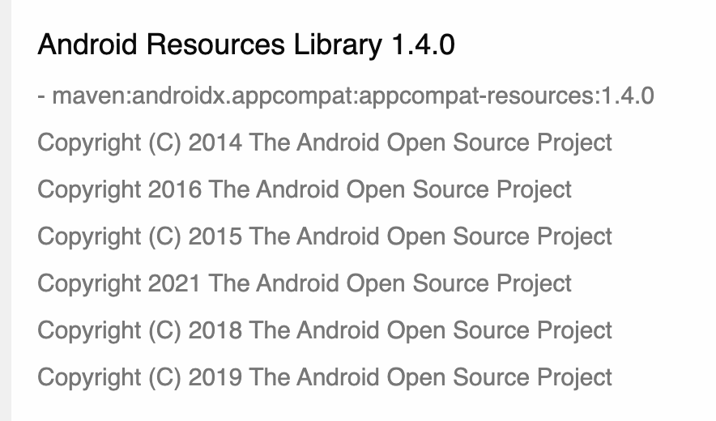

# 오픈소스SW 라이선스 고지문 작성 방법과 자동화 방안

연구자 : 장학성, 황은경

## 시작하며

소프트웨어 제품이나 서비스를 개발하는 기업이라면 오픈소스를 당연히 사용하고 있다. 오픈소스는 무료로 사용할 수 있지만 각 오픈소스의 라이선스를 준수하지 않거나 보안취약점을 고려하지 않는다면 예기치 않은 법적 소송이나 보안 공격으로 심각한 피해를 입을 수 있다. 최근 SFC(Software Freedom Conservancy)는 미국의 Smart TV 제조사인 Vizio가 오픈소스를 사용하여 제품을 개발하였음에도 오픈소스 라이선스 의무를 준수하지 않은 것을 이유로 소송을 제기하였다. 이번 소송의 결과에 따라 오픈소스를 사용하는 기업에게 오픈소스 소프트웨어의 저작권자 뿐만 아니라 일반 소비자도 기업에게 라이선스 의무 준수를 요구할 수 있게 될 수도 있다. 또한, 2021년 5월, 미국 정부는 사이버 보안 강화를 위해 SBOM (Software Bill of Materials) 제출을 의무화하는 행정 명령을 발표하였다. 따라서 기업은 소프트웨어 제품을 개발하면서 (1) 포함하는 오픈소스 목록을 SBOM 형태로 관리하고, (2) 각 오픈소스의 라이선스가 요구사하는 사항을 준수하기 위한 체계를 구축해야 효과적으로 라이선스 컴플라이언스와 보안취약점 리스크를 관리할 수 있다. 

오픈소스 라이선스는 크게 두가지 조건을 요구하는데, 바로 고지와 소스 코드 제공이다. 여기서 GPL은 소스 코드를 바로 제공하는 대신 요청 시 제공하겠다는 약정서를 문서화하여 제공(Written Offer)하는 것도 허용하고 있다. 따라서, 이러한 고지와 소스 코드 제공 요구사항을 준수하기 위해 많은 기업은 제품 배포 시, “오픈소스 고지문”을 동봉하고 있다. 즉, “오픈소스 고지문"을 올바르게 작성하고 제공하는 것은 기업이 오픈소스 라이선스 컴플라이언스에서 가장 중요한 활동이라고 할 수 있다. 

오픈소스 고지문에는 제품에 포함된 오픈소스가 무엇인지, 라이선스는 무엇인지 등에 대한 정보를 담고 있는데, 기업마다 문서의 양식과 내용이 조금씩 다르다. 

이번 연구에서는 주요 오픈소스 라이선스가 요구하는 고지에 대한 조건을 충족할 수 있는 오픈소스 고지문을 어떻게 하면 가능한 정확하고 쉽게 만들어 낼 수 있는지를 살펴 볼 것이다. 

그리고, SBOM 문서를 기반으로 올바른 오픈소스 고지문을 자동으로 생성하는 도구를 개발하고, 국내 기업이 사용할 수 있도록 오픈소스로 공개할 계획이다.

## 다루고자 하는 내용

### 1. 기업 별 오픈소스 고지문 비교

- 포함 내용
- 예)
    - 카카오 : [https://t1.daumcdn.net/osa/notice/24/1nnruomXqP/notice.html](https://t1.daumcdn.net/osa/notice/24/1nnruomXqP/notice.html)
    - SKT : [https://sktelecom.github.io/compliance/A._android_0.9.16_OSS_Notice.html](https://sktelecom.github.io/compliance/A._android_0.9.16_OSS_Notice.html)
    - LG전자 : [OSSNotice-4270_webOS22_K8HP_CommercialTV_220329.html](/2022-assets/OSSNotice-4270_webOS22_K8HP_CommercialTV_220329.html)
    - 삼성전자: [15_DTV_NT14_7.html](/2022-assets/15_DTV_NT14_7.html)
            
### 2. 주요 오픈소스 라이선스 별 고지 의무의 내용 및 세부 조건
- 대상 라이선스
    - GPL-2.0 / 3.0
    - LGPL-2.1 / 3.0
    - Apache-2.0
    - BSD
    - MIT
- 요구 조건
    - 라이선스 이름
    - 라이선스 전문
    - 저작권 정보
    - 오픈소스 이름 / 출처

### 3. 고지문 포함 내용
- indirect dependency 에 대해 고지해야 는가?
    - 이 프로젝트에 어떤 오픈소스가 포함되었는가? 를 알고 싶어하는 외부 개발자가 있을 수 있는데, indirect dependency까지 다 보여지면, 오히려 너무 많은 정보가 보여서 실제 어떤 오픈소스 라이브러리를 포함한건지 알아 볼 수가 없게 된다.
- a 오픈소스 내에 b, c code가 포함된 경우, a로만 고지하면 되는지? b, c도 다 고지해야 하는지?
    - (카카오) a의 repository내에 b, c가 이미 있다면 이를 따로 고지하지 않는다. 만약, a repository 내에 b, c 가 없다면 따로 고지한다.
- 저작권 정보는 포함해야 하는가?
    - 카카오에서 저작권 정보 확인 방식
        - metadata,
        - README, LICENSE
        - github으로 코드 확인
    - Linux kernel의 저작권은 몇만 라인이다. 이걸 다 해야 하는가?
    - Author? Copyright owner?
    - 연도만 다른 내용을 다 넣어 하는가?
        
        
    - 저작권 정보를 어디에서도 확인하지 못한 경우 “property of respective owners”라고 넣는다.

### 4. 고지 방법
   - 소프트웨어와 물리적으로 함께 배포 vs. 내부 서버에 존재하는 고지문의 링크만 제공 (네트워크 단절 시 접근 불가)

### 5. 오픈소스 고지문 생성 도구 개발 / 오픈소스로 공개

## References

- [https://fossa.com/blog/heather-meeker-open-source-license-notices-automation/](https://fossa.com/blog/heather-meeker-open-source-license-notices-automation/)
- [https://fossa.com/blog/q-and-a-heather-meeker-open-source-license-notices/](https://fossa.com/blog/q-and-a-heather-meeker-open-source-license-notices/)

